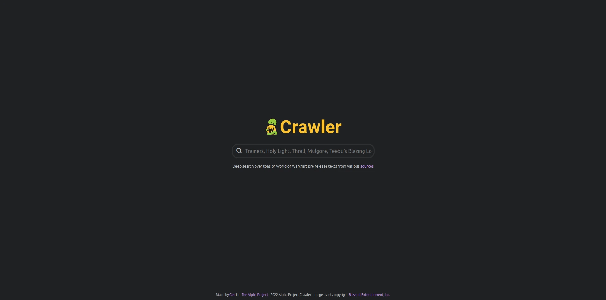
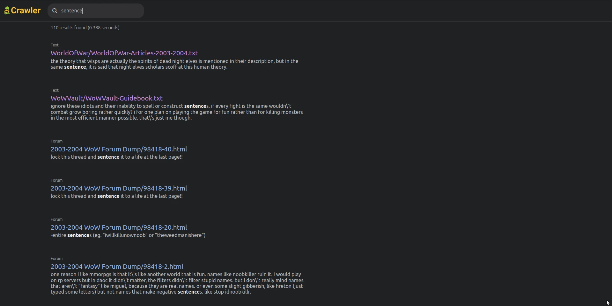
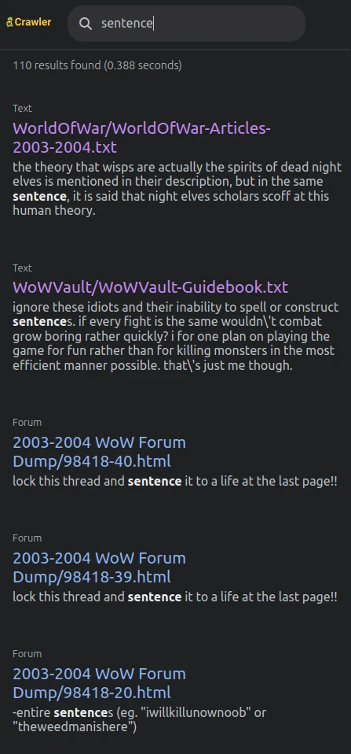

Text Crawler Website
====================

Find string patterns into big dataset of text files, and get the results on a website where you can click on a link to see the full source of each occurences.





Usable on most device as computers, tablets, phones.



Informations
------------

Provide a dataset to the crawler on your server, it could be scrapped website, texte files, code files, database files, or whatever readables files you want.

Then you will be able to search for string pattern on the website and see all the occurences and sources. 

The crawler uses the power of the GNU `grep` command to be able to return fast results. 
It could also find string pattern into images (generic AI OCR models)


Installation
------------

- Backend


Created with python `version 3.10.6` and `django rest framework`.
This is a simple web API, there is no need for a database.

The server must use a Linux distribution where `grep` is installed, a subprocess executing a grep command will be launch each time a search request comes.

You can configurate the API with the file `/backend/main/settings.py`.

Dataset should be placed into `backend/media/`. Folders of `/media` will be considered as a category. You can have many folders and subfolders you want.

Create Python env : 
```python -m venv NameOfEnv```

Activate you env : 
```source /NameOfEnv/bin/activate```

Install requirements : 
into `backend/` folder, type
```python -m pip install -r requirements```

Dev Server : 
```python manage.py runserver```


There is only one endpoints : http://url/search/?q=query


- Frontend

Created with `React` and `Sass`. Node version `17.9.1` and npm version `8.11.0`

HomePage   : `http://url/`
SearchPage : `http://url/search/:query`
SourcePage : `http://url/sources`


You need to set you API url into `frontend/src/config/general.js` like `http://localhost:8000/api/v1/`


Install dependencies
In `frontend/` folder, type : 
```npm install```


Dev Server : 
```npm start```


Run Build : 
```npm run build```


- Deploy

Change Django secret key located in `backend/main/settings.py`
Dont forget to add your domain name in ```/backend/main/settings.py```  ```ALLOWED_HOSTS=["yourDomain.com"]```
Serve Django API with gunicorn
Make react build with ```npm run build``` and import in to you server.

Configure Nginx web server like this : 

```
server {
    server_name DOMAIN.COM www.DOMAIN.COM;
    root /YourPath/Alpha-archives-website/frontend/build;
    index index.html index.htm index.nginx-debian.html;

    location / {
        try_files $uri $uri/ /index.html;
    }

    location /api {
        include proxy_params;
        proxy_pass http://127.0.0.1:8000;

    }

    location /media {
        autoindex on;
        alias /YourPath/media;
    }

}
```


Optimize search speed
----------------

The `grep` command that it uses to search occurences must crawl the dataset at every request.

If your dataset is quite small (less than 100mb), you probably don't need to optimize the search speed and you could run it on a basic HDD as storage.

If your dataset is quite big (~1gb), you probably don't need to optimize the search speed but you surely will need to use a SSD as storage on your server.

If your dataset is very big, the solution is to create a ramdisk that will contains most of your dataset to be able to crawl it at light speed.